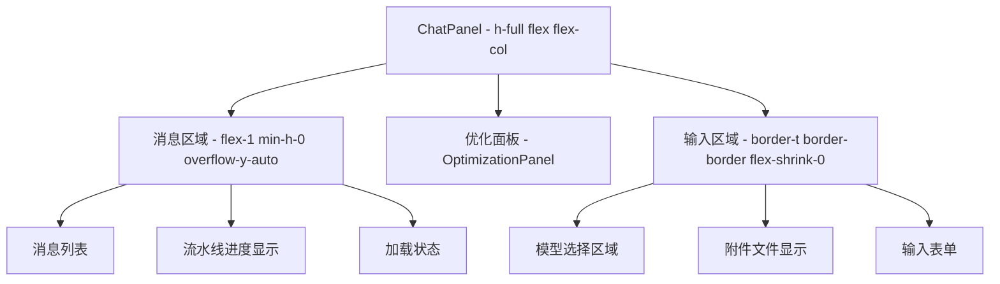
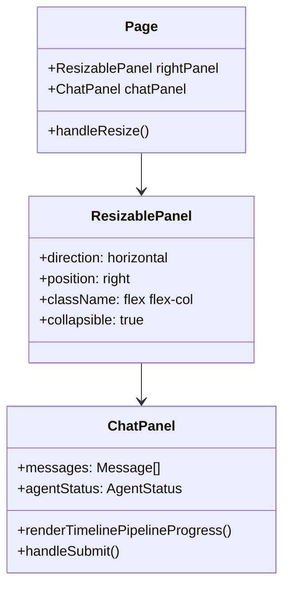
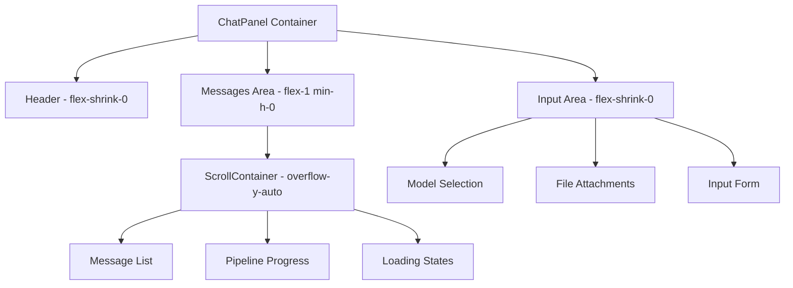
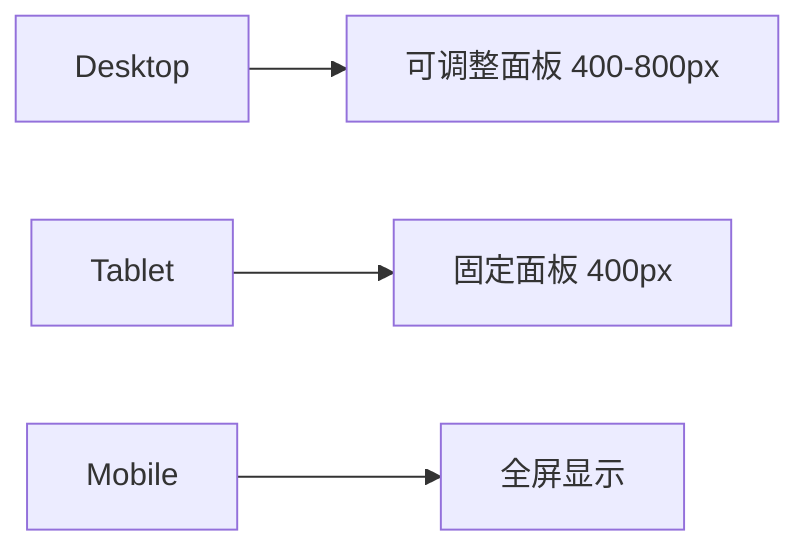

# 右侧聊天窗口滚动条设置优化设计

## 概述

本设计文档旨在优化项目中右侧聊天窗口的滚动条设置，确保输入文本框固定在页面底部，消息区域可以独立滚动，提升用户交互体验。

## 问题分析

### 当前布局结构

根据代码分析，当前聊天窗口（`ChatPanel`）采用以下布局结构：



### 存在的问题

1. **滚动区域定义不明确**：消息区域使用了`flex-1 min-h-0 overflow-y-auto`，但可能在某些情况下滚动行为不稳定
2. **输入框位置**：虽然使用了`flex-shrink-0`，但需要确保在所有屏幕尺寸下都能固定在底部
3. **嵌套滚动问题**：可能存在父容器和子容器的滚动冲突

## 技术架构

### 前端组件层次结构



### 布局规范

基于项目的前端布局规范，需要遵循以下原则：

1. **独立滚动区域**：使用`flex-1 min-h-0 overflow-y-auto`类组合
2. **固定区域**：使用`flex-shrink-0`类
3. **防止整体滚动**：确保页面使用`h-screen`防止整体滚动

## 设计方案

### 1. 布局结构优化



### 2. CSS类配置方案

#### 主容器配置
```typescript
// ChatPanel 根容器
className="h-full flex flex-col"
```

#### 消息区域配置
```typescript
// 消息滚动区域
className="flex-1 min-h-0 overflow-y-auto p-4 space-y-5"
```

#### 输入区域配置
```typescript
// 输入固定区域
className="border-t border-border flex-shrink-0"
```

### 3. 滚动行为优化

#### 自动滚动到底部
```typescript
// 使用 useEffect 和 messagesEndRef 实现
useEffect(() => {
  messagesEndRef.current?.scrollIntoView({ behavior: 'smooth' })
}, [messages])
```

#### 滚动区域标记
```typescript
// 在消息列表末尾添加滚动锚点
<div ref={messagesEndRef} />
```

### 4. 响应式适配

#### 不同屏幕尺寸下的表现



#### ResizablePanel 集成
- 最小宽度：400px
- 最大宽度：800px
- 默认宽度：500px
- 支持折叠功能

## 实现细节

### 1. 容器层次设置

- **外层容器**：`h-full flex flex-col` 确保占满父容器高度
- **消息区域**：`flex-1 min-h-0 overflow-y-auto` 可伸缩且可滚动
- **输入区域**：`flex-shrink-0` 固定高度不收缩

### 2. 滚动性能优化

- 使用`scroll-behavior: smooth`实现平滑滚动
- 消息更新时自动滚动到底部
- 避免不必要的重渲染

### 3. 交互体验增强

#### 滚动指示器
```typescript
// 当有新消息且用户不在底部时显示
{hasNewMessages && !isAtBottom && (
  <button onClick={scrollToBottom}>
    新消息 ↓
  </button>
)}
```

#### 键盘快捷键
- `Enter`：发送消息
- `Shift+Enter`：换行
- 输入时自动聚焦到输入区域

### 4. 状态管理

#### 消息状态
```typescript
interface ChatState {
  messages: Message[]
  loading: boolean
  agentStatus: AgentStatus | null
  currentPipelineState: PipelineState
}
```

#### 滚动状态
```typescript
interface ScrollState {
  isAtBottom: boolean
  hasNewMessages: boolean
  scrollPosition: number
}
```

## 测试策略

### 1. 功能测试

- **滚动行为测试**：验证消息区域独立滚动
- **输入框位置测试**：确保输入框始终在底部
- **响应式测试**：不同屏幕尺寸下的表现

### 2. 交互测试

- **消息发送测试**：验证发送后自动滚动到底部
- **文件上传测试**：附件显示不影响布局
- **模型切换测试**：模型选择不影响滚动区域

### 3. 性能测试

- **大量消息测试**：验证长对话的滚动性能
- **实时更新测试**：流水线进度更新时的滚动表现
- **内存泄漏测试**：长时间使用的内存占用

## 兼容性考虑

### 浏览器兼容性
- Chrome/Safari/Firefox 最新版本
- 移动端浏览器支持
- 触摸设备滚动体验

### 设备适配
- 桌面端：可调整面板大小
- 平板端：固定尺寸布局
- 移动端：全屏聊天模式

## 维护指南

### 代码组织
- 样式相关的类名保持一致
- 滚动逻辑集中在自定义Hook中
- 组件职责单一，便于测试

### 性能监控
- 监控滚动性能指标
- 跟踪内存使用情况
- 用户交互响应时间

### 扩展性设计
- 支持自定义滚动行为
- 预留主题切换接口
- 组件可复用性设计