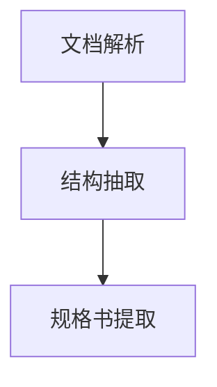

# Project Agent

一个基于多智能体的投标文件生成系统，通过智能化文档解析与交互式确认，逐步生成投标文件所需材料。

## ✨ 特性

- 🤖 **多智能体协作** - 基于 LangGraph 的智能体编排系统
- 📄 **智能文档解析** - 支持 PDF/DOCX 自动解析转换
- 🏗️ **结构化抽取** - 智能分析文档结构，生成投标文件骨架
- 📋 **规格书提取** - 精准提取技术规格和要求
- 📝 **方案生成（按需）** - 用户确认后按要求生成技术方案
- 🎨 **现代界面** - 响应式三面板设计
- 📊 **实时追踪** - Pipeline 处理进度可视化

## 🏗️ 技术栈

### 后端
- **Python 3.11+** - 现代 Python 开发
- **FastAPI** - 高性能异步 Web 框架
- **LangGraph** - 多智能体编排框架
- **Pydantic** - 数据验证和配置管理
- **OpenRouter** - 统一 LLM API 接口

### 前端
- **Next.js 14** - React 全栈框架
- **TypeScript** - 类型安全的 JavaScript
- **Tailwind CSS** - 现代 CSS 框架
- **React 18** - 最新 React 特性

## 🚀 快速开始

### 环境要求

- Python 3.11+
- Node.js 18+
- [uv](https://docs.astral.sh/uv/) (推荐的 Python 包管理器)

### 1. 克隆项目

```bash
git clone https://github.com/idadawn/project-agent.git
cd project-agent
```

### 2. 环境配置

创建 `.env` 文件：

```env
# LLM API 配置
OPENROUTER_API_KEY=your_openrouter_api_key
DEFAULT_MODEL=anthropic/claude-3-sonnet-20241022

# 服务器配置
BACKEND_PORT=8001
FRONTEND_PORT=11010

# 文件路径配置
UPLOADS_DIR=uploads
WIKI_DIR=wiki
```

### 3. 安装依赖

#### 后端 (使用 uv)

```bash
cd backend

# 使用 uv 安装依赖
uv sync

# 或者使用传统方式
pip install -e .
```

#### 前端

```bash
cd frontend
npm install
```

### 4. 启动服务

#### 后端服务

```bash
cd backend

# 使用 uv 运行
python -m uvicorn main:app --host 0.0.0.0 --port 8001 --reload

# 或直接运行
python main.py
```

后端服务: `http://localhost:8001`

#### 前端服务

```bash
cd frontend
npm run dev -- -p 11010
```

前端应用: `http://localhost:11010`

## 💼 使用指南

### 基本工作流程（交互式）

1. **📤 上传招标文件**（PDF/DOC/DOCX）
2. **🧠 文档解析**：自动转换为 `wiki/招标文件.md`
3. **🏗️ 结构抽取**：生成 `wiki/投标文件_骨架.md`
4. **📋 规格提取**：生成 `wiki/技术规格书_提取.md`
5. **✅ 用户确认**：在对话中逐一确认以上三份文件是否正确
   - 回复“确认招标文件”确认 `招标文件.md`
   - 回复“确认骨架”确认 `投标文件_骨架.md`
   - 回复“确认规格书”确认 `技术规格书_提取.md`
6. **📝 技术方案（按需生成）**：用户在对话中输入具体要求（如技术路线、设备品牌、工期目标等），系统基于 `技术规格书_提取.md` 为核心、参考 `招标文件.md` 生成 `wiki/技术方案.md`

### 智能体工作流

当前默认工作流（自动阶段）仅包含：



- **📑 文档解析智能体**：解析文档转换为 Markdown（`招标文件.md`）
- **🏗️ 结构抽取智能体**：分析结构生成骨架（`投标文件_骨架.md`）
- **📋 规格书提取智能体**：提取技术规格（`技术规格书_提取.md`）

技术方案生成为按需交互步骤：用户确认后并提供要求时，再由系统生成 `技术方案.md`。

## 📁 项目结构

```
project-agent/
├── backend/                 # 🐍 后端服务
│   ├── agents/             #   🤖 智能体实现
│   ├── api/v1/             #   🌐 API 接口
│   ├── app_core/           #   ⚙️ 核心应用
│   ├── prompts/            #   💬 提示词模板
│   ├── services/           #   🔧 业务服务
│   ├── utils/              #   🛠️ 工具函数
│   ├── workflow/           #   📊 工作流定义
│   ├── main.py             #   🚀 应用入口
│   └── pyproject.toml      #   📦 项目配置
├── frontend/                # ⚛️ 前端应用
│   ├── app/                #   📱 Next.js 应用
│   ├── components/         #   🧩 React 组件
│   ├── hooks/              #   🪝 React Hooks
│   ├── lib/                #   📚 工具库
│   └── package.json        #   📦 项目配置
├── uploads/                 # 📁 上传目录
├── wiki/                    # 📝 输出目录
└── README.md               # 📖 项目说明
```

## 🔧 开发

### 开发环境设置

```bash
# 1. 克隆项目
git clone https://github.com/idadawn/project-agent.git
cd project-agent

# 2. 后端开发环境
cd backend
uv sync --dev  # 安装开发依赖
uv run python main.py

# 3. 前端开发环境
cd frontend
npm install
npm run dev -- -p 11010
```

### 代码规范

- **Python**: 使用 `ruff` 进行 linting 和格式化
- **TypeScript**: 使用 ESLint 和 Prettier
- **提交**: 遵循约定式提交规范

### 添加新智能体

```python
from agents.base import BaseAgent

class NewAgent(BaseAgent):
    def get_system_prompt(self) -> str:
        return "你的系统提示词"
    
    async def process(self, input_data: dict) -> dict:
        # 实现处理逻辑
        return result
```

## 📡 API 文档

启动后端服务后访问:
- Swagger UI: `http://localhost:8001/docs`
- ReDoc: `http://localhost:8001/redoc`

主要端点:
- `POST /api/v1/files/upload` - 文件上传
- `GET /api/v1/files/` - 文件列表
- `POST /api/v1/pipeline/run` - 启动处理
- `GET /api/v1/pipeline/status` - 查看状态

## 🚢 部署

### 生产环境

```bash
# 构建前端
cd frontend && npm run build

# 启动后端
cd backend && uvicorn main:app --host 0.0.0.0 --port 8001

# 启动前端
cd frontend && npm start
```

### Docker 部署

```dockerfile
# Dockerfile 示例
FROM python:3.11-slim

# 安装 uv
RUN pip install uv

# 复制并安装依赖
COPY backend/pyproject.toml /app/
WORKDIR /app
RUN uv sync --no-dev

# 复制代码
COPY backend/ /app/

EXPOSE 8001
CMD ["uv", "run", "uvicorn", "main:app", "--host", "0.0.0.0", "--port", "8001"]
```

## ❓ 常见问题

<details>
<summary><b>如何配置 LLM API？</b></summary>

在 `.env` 文件中设置：
```env
OPENROUTER_API_KEY=your_api_key
DEFAULT_MODEL=anthropic/claude-3-sonnet-20241022
```
</details>

<details>
<summary><b>支持哪些文档格式？</b></summary>

目前支持：
- PDF 文档
- DOCX 文档
- 计划支持更多格式
</details>

<details>
<summary><b>前端无法连接后端？</b></summary>

检查：
1. 后端服务是否运行在 8001 端口
2. CORS 配置是否正确
3. 防火墙设置
</details>

## 🤝 贡献

欢迎贡献！请遵循以下步骤：

1. Fork 本仓库
2. 创建特性分支 (`git checkout -b feature/amazing-feature`)
3. 提交更改 (`git commit -m 'feat: add amazing feature'`)
4. 推送分支 (`git push origin feature/amazing-feature`)
5. 创建 Pull Request

## 📄 许可证

本项目采用 [MIT 许可证](LICENSE)。

## 📞 联系

- 项目地址: [GitHub](https://github.com/idadawn/project-agent)
- 问题反馈: [Issues](https://github.com/idadawn/project-agent/issues)

---

<div align="center">
  <sub>Built with ❤️ using modern web technologies</sub>
</div>
